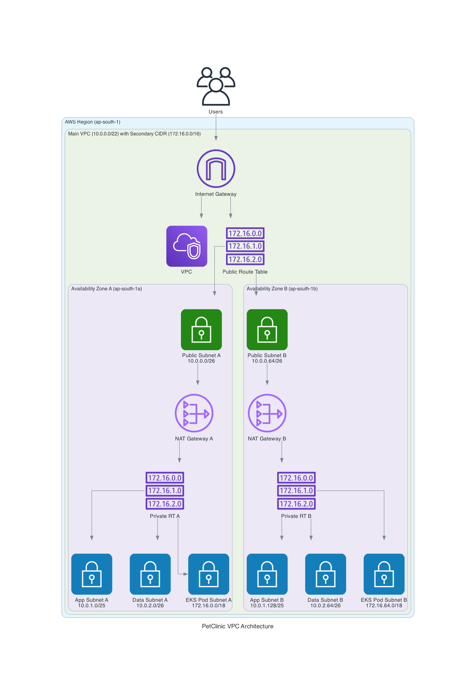

# PetClinic VPC Architecture: Technical Documentation

## Overview

This document outlines the AWS VPC network architecture designed for the PetClinic application, emphasizing the design considerations and AWS best practices implemented.

## Architecture Diagram

*The diagram shows the VPC structure with subnets across two availability zones, including NAT gateways, route tables, and internet gateway.*

## VPC Design Specifications

| Resource | Configuration | Details |
|----------|--------------|---------|
| Main VPC | CIDR: `10.0.0.0/22` | Provides 1,024 IP addresses |
| Secondary CIDR | CIDR: `172.16.0.0/16` | Dedicated for EKS pods with 65,536 IP addresses |
| Availability Zones | 2 (ap-south-1a, ap-south-1b) | Multi-AZ for high availability |
| Subnet Types | Public, App, Data, EKS Pod | Tiered architecture for security isolation |

## Network Components

### Subnets & CIDR Allocation

The VPC implements a tiered subnet structure with calculated CIDR allocations:

**Public Subnets**
- Purpose: Host internet-facing components (NAT Gateways)
- CIDR: `10.0.0.0/26` (ap-south-1a) - 64 IPs
- CIDR: `10.0.0.64/26` (ap-south-1b) - 64 IPs
- Public IP auto-assignment: Enabled

**App Subnets (Private)**
- Purpose: Host application layer (EKS nodes)
- CIDR: `10.0.1.0/25` (ap-south-1a) - 128 IPs
- CIDR: `10.0.1.128/25` (ap-south-1b) - 128 IPs

**Data Subnets (Private)**
- Purpose: Host database resources (Aurora)
- CIDR: `10.0.2.0/26` (ap-south-1a) - 64 IPs
- CIDR: `10.0.2.64/26` (ap-south-1b) - 64 IPs

**EKS Pod Subnets (Private)**
- Purpose: Dedicated for EKS pod IP allocation
- CIDR: `172.16.0.0/18` (ap-south-1a) - 16,384 IPs
- CIDR: `172.16.64.0/18` (ap-south-1b) - 16,384 IPs

### Internet Connectivity

- **Internet Gateway**: Attached to the VPC for public subnet internet access
- **NAT Gateways**: One per AZ for high availability
  - Placed in public subnets with Elastic IPs
  - Enable private resources to access the internet while remaining private

### Routing

- **Public Route Table**: Routes traffic from public subnets to the internet (0.0.0.0/0 → IGW)
- **Private Route Tables**: Separate route table per AZ for fault isolation
  - Routes internet traffic from private subnets via NAT Gateway (0.0.0.0/0 → NAT)

### Network Access Control

- **Public NACL**:
  - Inbound: HTTP (80), HTTPS (443), SSH (22), Ephemeral ports (1024-65535)
  - Outbound: All traffic
- **Private NACL**:
  - Inbound: Traffic from VPC CIDR ranges only
  - Outbound: All traffic

## AWS Best Practices Implemented

1. **High Availability**
   - Resources deployed across multiple AZs
   - NAT Gateway per AZ for redundancy
   - Zone-isolated routing tables

2. **Security-in-Depth**
   - Multi-tier subnet architecture
   - Network traffic isolation with NACLs
   - Public internet access restricted to public subnets

3. **EKS Networking Best Practices**
   - Dedicated secondary CIDR for pod IPs
   - Sufficient IP space allocated for pod density
   - Kubernetes-specific subnet tagging:
     - `kubernetes.io/role/elb: "1"` for public subnets
     - `kubernetes.io/role/internal-elb: "1"` for private subnets

4. **IP Address Management**
   - Subnet sizing based on expected workload types
   - Larger subnets for app tier (higher instance count)
   - Smaller subnets for database tier (fewer instances)
   - Extensive address space for pods (largest allocation need)

5. **Future-Proofing**
   - VPC design allows for additional subnet tiers
   - IP space allocation considers growth

## Design Rationale

### CIDR Block Selection
- **Primary VPC (10.0.0.0/22)**: Provides 1,024 IP addresses for infrastructure
  - Balances address space with practical management needs
  - Avoids common VPC CIDR ranges to prevent VPC peering conflicts

- **Secondary CIDR (172.16.0.0/16)**: Dedicated large space for EKS pods
  - Follows Kubernetes best practice for non-overlapping pod IPs
  - Large CIDR prevents pod IP exhaustion in production environments

### Subnet Tier Isolation
- Distinct subnets for different application tiers ensure:
  - Traffic flow control between layers
  - Resource isolation for security
  - Targeted routing policies per tier

### NACL Implementation
- Layered security approach with:
  - Public subnet NACLs limiting inbound ports
  - Private subnet NACLs restricting traffic to VPC-originated only

## Performance Considerations

- NAT Gateways sized appropriately for expected traffic volume
- Subnet CIDRs allocated to balance IP consumption with AWS subnet limits
- Route table design minimizes latency for cross-AZ communication

## Operational Aspects

- VPC layout supports Infrastructure-as-Code deployment
- Subnet tagging enables automated resource deployment
- Design accommodates future AWS service integrations
- HA pattern allows for zone failures without system outage
